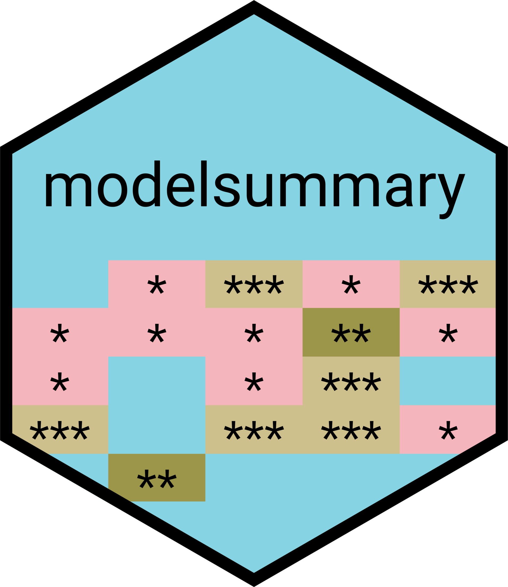

```{r setup, include=FALSE}
options(htmltools.dir.version = FALSE)
knitr::opts_chunk$set(fig.retina = 3, warning = FALSE, message = FALSE)

def.chunk.hook  <- knitr::knit_hooks$get("chunk")
knitr::knit_hooks$set(chunk = function(x, options) {
  x <- def.chunk.hook(x, options)
  ifelse(options$size != "normalsize", paste0("\n \\", options$size,"\n\n", x, "\n\n \\normalsize"), x)
})

# load packages
library(readxl) # this package allows you to read .xlsx files into R
library(haven) # this package allows you to read & write stata .dta files
library(tabulator) # this is a package that is useful for making cross-tabs
library(janitor) # contains useful commands for data cleaning
library(tidycensus) # an R package that allows users to interface with a select
                    # number of the US Census Bureau’s data APIs and return 
                    # tidyverse-ready data frame
library(palmerpenguins)
library(gapminder) # contains an excerpt of data from Gapminder (https://www.gapminder.org/data/)
library(rvest) # a tidyverse package for webscraping
library(glue) # tidyverse-adjacent package makes working with interpreted string literals simpler
library(lubridate) # tidyverse package for working with dates
library(fixest)
library(infer)
library(broom)
library(modelsummary)
library(gtsummary) # for summary tables
library(tidyverse) # this loads the 8 core packages of the tidyverse
library(tidylog) # this is a package that adds extra explanation of tidyverse commands

```

# Welcome to Day 2

## Agenda
1. Questions from yesterday's topics

--

2. Descriptive statistics & nice looking tables

--

3. Linear Regression & exporting nice looking tables

--

4. Data Visualization 
---

class: middle, center, inverse
# Questions?

---

# Descriptive statistics

We already saw how you use `dplyr` commands like `mutate()` and `summarise()` to compute descriptive statistics, such as means, standard deviations, etc:

--

```{r load WDI, echo=FALSE}
wdi <- read_excel("./data/Data_Extract_From_World_Development_Indicators.xlsx")

wdi <- read_excel("./data/Data_Extract_From_World_Development_Indicators.xlsx",
                       n_max = max(which(wdi$`Country Name` == "Zimbabwe"))) %>%
    clean_names() %>%
    select(-c(country_code, series_code)) %>%
    rename(
        country = country_name,
        series = series_name
    ) %>%
    mutate(across(starts_with("x"), as.numeric)) 

wdi_long <- wdi %>% # this time we'll save it as a new object
    pivot_longer(
        -c(country, series), 
        names_to = "year",
        names_pattern = "(\\d+)",
        names_transform = list(year = as.integer),
        values_to = "value") 

wdi_long <- wdi_long %>%
    mutate(
        series_short = case_when( # use case_when() for conditional operations
            str_detect(series, "electricity") ~ "electricity",
            str_detect(series, "(?=.*Education)(?=.*female)") ~ "edu_female",
            str_detect(series, "(?=.*Education)(?=.*male)") ~ "edu_male",
            str_detect(series, "GDP per capita") ~ "gdppc",
            str_detect(series, "malaria") ~ "malaria",
            str_detect(series, "Internet") ~ "internet",
            str_detect(series,  "(?=.*Labor)(?=.*female)") ~ "lfp_female",
            str_detect(series, "(?=.*Labor)(?=.*male)") ~ "lfp_male",
            str_detect(series, "Military") ~ "military",
            str_detect(series, "Poverty") ~ "poverty_gap",
            str_detect(series, "Prevalence") ~ "underourished"
        )
    ) 

wdi_df <- wdi_long %>%
    select(-series) %>%
    pivot_wider(
        names_from = "series_short",
        values_from = "value"
        )


```

.pull-left[
```{r code-summary, eval=FALSE}
wdi_df %>%
    group_by(country) %>%
    summarise_at(
        vars(gdppc, electricity, malaria), 
        mean, na.rm = TRUE) %>%
    head(n = 5)
```
]

.pull-right[
```{r output-summary, ref.label="code-summary", echo=FALSE}

```
]

--

But often you will want to prepare nice looking, well-formatted tables to include in reports and publications. And there are *many* packages in R that can help with this. I like [`gtsummmary`](https://www.danieldsjoberg.com/gtsummary/) because it is relatively easy to make nice looking tables, but also flexible and extensively customizable for different needs. `gtsummmary` is also `tidyverse` adjacent package, so it fits nicely with the family of packages we're already working with.

---
layout:true
# Summary tables with `gtsummary`
---

`gtsummary` contains two primary commands: `tbl_summary()`, which is for summary or descriptive tables, and `tbl_regression()`, which is for tables of regression results (more on this later). Make sure to install it (only before the first use) and load it along with all your other packages.

```{r install-gtsummary}
# install.packages("gtsummary") # uncomment to install
library(gtsummary)

```

To demonstrate the functionality, let's work with a smaller version of this WDI data: a sub-sample of just South Asian countries with fewer variables.

```{r filter-SA}

sa <- wdi_df %>%
     mutate(
        # create a logical variable to filter with
        south_asia = country %in% c("Afghanistan", "Bangladesh","Bhutan",
                                         "India", "Maldives", "Nepal", 
                                         "Pakistan", "Sri Lanka")
    ) %>%
    filter(south_asia) %>%
    select(country, year, electricity, malaria, gdppc)

```

---

The default output from `tbl_summary()` is meant to be publication ready. The `tbl_summary()` function takes a data frame as the only input, and returns descriptive statistics for each column in the data frame. This command has some useful features:

- Variable types are automatically detected so that appropriate descriptive statistics are calculated.
- Label attributes from the data set are automatically printed.
- Missing values are listed as “Unknown” in the table.
- Variable levels are indented and footnotes are added.

---


```{r tbl_summary}
sa %>%
    tbl_summary(by = country)

```

???
This is what an "off-the-shelf" table looks like. I'm using the `by = country` option to get summary statistics by country. Ask what the table is showing first, then explain. 

By default, this has given us the median value of each variable for each country (remember we have 12 years) and put the interquartile range in parentheses. It also gave us this for the year, which we don't really want.
---

Remember factor variables from yesterday? Factors are used for storing categorical variables and have a lot of useful properties for plotting as we'll see later. Factors are comprised of two components: the actual values of the data and the possible levels within the factor. 

Let's see what happens if we convert `year` from a numeric variable to a factor:
.pull-left[
```{r wdi-factor, eval=FALSE}
sa %>%
    mutate(
        year = factor(year)
    ) %>%
    tbl_summary(by = country)

```
]

.pull-right[
```{r output-factor, ref.label="wdi-factor", echo=FALSE}

```
]

???
This is a pretty ugly table now - but you can see that year is being treated differently - instead of giving us a median & IQR, it's reporting the number of observations per country & year with the % in parentheses. So for example, in 2010 we have 1 observation for afghanistan, which is 8.3% of all the observations for afghanistan 
---

Now, let's see how this can be further customized. We'll get rid of the `year` variable, which we don't need in the table and change which statistics we want to show:

.pull-left[
```{r code-table1, eval=FALSE}
sa %>%
    select(-c(year)) %>%
    tbl_summary(
        by = country,
        statistic = all_continuous() ~ "{mean} ({sd})"
        )
```
]

.pull-right[
```{r output-table1, ref.label="code-table1", echo=FALSE}

```
]

???
Explain the all_continuous. Looking better, but now let's add some styling.
---

.pull-left[
```{r code-table2, eval=FALSE}
sa %>%
    select(-c(year)) %>%
    tbl_summary(
        by = country,
        statistic = all_continuous() ~ "{mean} ({sd})",
        digits = all_continuous() ~ 2,
        label = list(
            electricity ~ "Electricity access (% of population)",
            malaria ~ "Malaria prevalence (% of population",
            gdppc ~ "GDP per capita"),
        missing_text = "Missing"
        )
```
]

.pull-right[
```{r output-table2, ref.label="code-table2", echo=FALSE}

```
]

???
Explain the digits is rounding. We can also get rid of the missing row and add an overall column, which is handy
---

```{r code-table3, eval=FALSE}
sa %>%
    select(-c(year)) %>%
    tbl_summary(
        by = country,
        statistic = all_continuous() ~ "{mean} ({sd})",
        digits = all_continuous() ~ 2,
        label = list(
            electricity ~ "Electricity access (% of population)",
            malaria ~ "Malaria prevalence (% of population",
            gdppc ~ "GDP per capita (constant 2015 US$)"),
        missing = "no"
        ) %>%
    # you can pipe the different commands
    add_overall() %>%
    modify_caption("**Table 1. Development Characteristics for South Asia (2010 - 2021)**") %>%
    bold_labels()
```


---


```{r output-table3, ref.label="code-table3", echo=FALSE}

```

---

Let's look at another example, using a sample dataset that comes with the `gtsummary` package when you load it. This set contains data from 200 patients who received one of two types of chemotherapy (Drug A or Drug B). The outcomes are tumor response and death.

```{r trial}
head(trial)

```

---

Often with data like this, you want to compare characteristics across two groups (Drug A vs. Drug B) and calculate whether the differences are statistically significant. You can easily do this with `tbl_summary()`. 

```{r trial-tbl-code}
tbl <- trial %>%
    select(trt, age, stage, marker) %>%
    tbl_summary(
        by = trt,
        missing = "no",
        digits = age ~ 1,
        statistic  = all_continuous() ~ "{mean} ({sd})") %>%
    add_overall() %>% # adds an overall column
    add_n() %>% # adds the overall sample size
    add_difference() %>% # calculates diff b/w Drug A & B; p-value
    # add_difference also adds the CI by default, but i chose to hide that column
    modify_column_hide(ci)

```
???
Explain overall, n, diff; highlight the nice labels

---

```{r trial-tbl-output, echo=FALSE}
tbl
```

---

`gtsummary` tables can be saved as an images, RTFs, .tex files, PDFs, or Word files. Depending on what type of file you want to export your table as, you may need to use a companion package.

```{r save-gttable, eval=FALSE}

tbl %>%
  as_gt() %>% # need to convert to a "gt" object first
  # use extensions .html .tex .ltx .rtf
  gt::gtsave(filename = "./output/trial_characteristics.tex") 


tbl %>%
  as_flex_table() %>% # need to convert to a "flex_table" object first
  flextable::save_as_docx(path = "./output/trial_characteristics.docx")


```

---

There are many more options to customize your tables. Remember to read the detailed "vignette" on [`gtsummary`](https://www.danieldsjoberg.com/gtsummary/index.html) and use the help option within R: `?tbl_summary()` or `help(tbl_summary)`. 

And, always remember to Google your specific question and look for answers on [stack overflow](https://stackoverflow.com/). Odds are, someone else has had the same question and you'll find a solution!

---
layout: false
class: middle, center, inverse
# Questions?
---

# Statistical Inference

All of the statistical inference tasks you've learned about in classes and maybe how to perform in other programs (e.g. Stata) are possible in R. I'll demonstrate two common tasks:

--

1. t-tests
2. Linear regression

--

In addition to many built in commands that come in every installation of R, we'll use a few additional packages that make it easy to do common things (e.g., cluster standard errors, absorb fixed effects), as well as create publication ready tables and figures from your results.

```{r reg-packages, eval = F}
install.packages("fixest") # fixed effects regression, TSLS, & SE
install.packages("broom") # for creating "tidy" regression tables
install.packages("AER") # contains all the datasets from Stock & Watson
install.packages("sandwich") # for calculating robust SE
install.packages("clubSandwich") # for calculating cluster-robust SE

```

For anyone that learned econometrics here at SPP with the Stock and Watson textbook, there is an [online R companion](https://www.econometrics-with-r.org/) to that book that demonstrates how to do everything in R. 

???
This topic will not focus on any of the theory behind these tasks - that's for your econometrics courses - just demonstrate how to do them in R. 
---

# Penguin Data

.pull-left[
To demonstrate some of these tasks, we'll use a datas et on penguins, collected at the Palmer station in Antarctica. It's designed for demonstrating patterns in data (and is more fun than student-teacher ratios `r emo::ji("wink")`).

You can access this data by installing, loading the package, & calling the data:

```{r penguins, eval = FALSE}
install.pacakges("palmerpenguins")
library(palmerpenguins)
penguins # loads the data

```

]

.pull-right[
Palmer Penguins (art by [Allison Horst](https://allisonhorst.github.io/))

]
---
# Penguin Data

Let's take a look at what's in this data:

```{r glimpse-penguins, echo =FALSE}

glimpse(penguins)

```
---

layout: true
# t-tests
---

Base R option includes a command to run t-test: `t.test()`. Let's go to RStudio and take a quick look at the help page for `t.test()` first.

--

Let's do a simple t-test to test a hypothesis about the mean flipper length of penguins:
$$H_0: \mu = 185 \\
H_1: \mu \neq 185$$

--

.pull-left[
```{r ttest-code, eval = FALSE}
t.test(
    flipper_length_mm ~ 1, 
    mu = 185, alternative = "two.sided", 
    data = penguins #<<
)

```
]

--

.pull-right[
```{r ttest-results, ref.label="ttest-code", echo=FALSE}
```
]

???
We haven't used a lot a non-tidyverse commands/commands without pipes - so i want to draw your attention to attention to the data argument in this command. if you're not working with a pipe (where you specify the dataframe first and then chain commands), then you MUST tell R what data frame you're working with
---

Is there a tidyverse t-test, you ask? `r emo::ji("thinking")` 

--
Why yes, of course there is `r emo::ji("raised_hands")` 

It comes in the [`infer`](https://infer.netlify.app/) package. And, the syntax is very similar to the base R command, but the output is a little nicer to look at. The output is conveniently stored in a tidy tibble, which you can export as a table or make a plot with. Let's take a quick look at the documentation in R.

--
```{r ttest-code-tidy, eval = FALSE}
penguins %>% #<<
    t_test(
        response = flipper_length_mm, #<<
        mu = 185,  alternative = "two.sided"
        )


```

--


```{r ttest-results-tidy, ref.label="ttest-code-tidy", echo=FALSE}
```

???
Here I highlighted where we call the data when using a pipe, just to emphasize the difference with the base R option. I also highlight the line where we specify the variable we're testing a hypothesis about. It;s called a response variable.
---

Let's do a two-group t-test, where we are testing whether the flipper length of male and female penguins is the same.

$$H_0: \mu_M = \mu_F \\
H_1: \mu_M \neq  \mu_F$$


--

```{r ttest-code-tidy2, eval = FALSE}
penguins %>% 
    t_test(
        formula = flipper_length_mm ~ sex, #<<
        alternative = "two.sided"
    )


```

--

```{r ttest-results-tidy2, ref.label="ttest-code-tidy2", echo=FALSE}
```
???
Now we're specifying a formula, that says test the difference of the first variable according to groups of the 2nd variable. 

---
layout: false
class: middle, center, inverse
# Questions?
---

layout:true
# Regression
---

R comes with built in commands to run regressions. The primary command is `lm()` (linear model). Let's look at the help file.

--

Let's start with a simple OLS to look at the relationship between body mass and flipper length of penguins.

```{r lm}
lm(body_mass_g ~ flipper_length_mm, data = penguins)

```
???
ask someone to explain the output/interpret the coefficient
---

If you want to see a bit more information (standard errors maybe?), you need to call `summary()` on an `lm` object.

Notice that I am storing the regression in a new object I called `reg`:

```{r lm-summary}
reg <- lm( #<<
    body_mass_g ~ flipper_length_mm, 
    data = penguins) 
summary(reg)

```

---


```{r lm-summary-results, ref.label="lm-summary", echo=FALSE}
```

???
ask them to explain the output
---

The [`broom`](https://broom.tidymodels.org/) package provides a few tools to conveniently summarize regression models in R. As always, make sure you install (just once) and load the package prior to use. The `broom::tidy()` command produces a nice, tidy table of your regression results.

--

```{r broom}
tidy(reg)
```

---

Let's add a few more variables to this model and make it a multivariate regression.

--

```{r multireg}
mvreg <- lm( 
    body_mass_g ~ flipper_length_mm + bill_length_mm + bill_depth_mm + sex, #<<
    data = penguins) 

```


The only difference is that you add each additional variable with a **+**.

---


```{r multireg-results}
tidy(mvreg, conf.int = TRUE)

```

This time, I included an option to add the confidence interval to the output. The default is a 95% confidence interval, but you can change the level by specifying the option `conf.level = 0.90` (which would give you a 90% CI).

???
interpret the coefficient on sex. sex is a factor variable -- so R knows to treat it like a binary variable in the regression.
---
layout: false
# Regression tables with `gtsummary`

We already saw how to use `gtsummary::tbl_summary()` to produce publication ready tables of summary statistics. We can also use it to produce regression tables with the command `tbl_regression()`.

.pull-left[
```{r tbl-reg}
tbl_regression(reg)

```
]

.pull-right[
```{r tbl-mvreg}
tbl_regression(mvreg)

```
]

--

That's a pretty good start - and you can do a lot better with some customization, but I personally prefer [`modelsummary`](https://vincentarelbundock.github.io/modelsummary/index.html) for regression tables.

???
You can combine these easily too into a single table.
---

layout: true
#  Regression tables with `modelsummary` 
---

```{r modelsummary, eval=FALSE}

modelsummary(
    list(
        "Simple OLS" = reg,
        "Multivariate Model" = mvreg
    ),
    gof_map = c("nobs", "r.squared"),
    stars = T
)

```
???
Explain the syntax (gof == goodness-of-fit) - the default includes a lot of extra statistics that i don't think are necessary. so here i'm keeping just the N & R2
---


```{r modelsummary-results, ref.label="modelsummary", echo=FALSE}
```

---

Let's customize a bit more -- just to see the full extent of what's possible with a little more work.


```{r modelsummary2, eval=FALSE}

modelsummary(
    list(
        "Simple OLS" = reg,
        "Multivariate Model" = mvreg
    ),
    fmt = 2,
    coef_map= c(
        "flipper_length_mm" = "Flipper Length (mm)", 
        "bill_length_mm" = "Bill Length (mm)",
        "bill_depth_mm" = "Bill Depth (mm)",
        "sexmale" = "Male", 
        "(Intercept)" = "Constant"),
    gof_map = c("nobs", "r.squared"),
    stars = F,
    notes = list("This table presents results of univariate and multivarate 
                 regression models."),
    output = "table1.png" # can change to other formats
    ) 

```

???
Explain all the syntax.

---

```{r modelsummary-results2, echo=FALSE}

modelsummary(
    list(
        "Simple OLS" = reg,
        "Multivariate Model" = mvreg
    ),
    fmt = 2,
    coef_map= c(
        "flipper_length_mm" = "Flipper Length (mm)", 
        "bill_length_mm" = "Bill Length (mm)",
        "bill_depth_mm" = "Bill Depth (mm)",
        "sexmale" = "Male", 
        "(Intercept)" = "Constant"),
    gof_map = c("nobs", "r.squared"),
    stars = F,
    notes = list("This table presents results of univariate and multivarate 
                 regression models.") 
    ) 
```

???
The preview mode for these tables is actually different from how it saves - so let's take a quick look at that.
---

layout: true
# Leveling up regression with `fixest`
---

[`fixest`](https://cran.r-project.org/web/packages/fixest/vignettes/fixest_walkthrough.html) is a package designed for fast implementation of fixed effects regression, but also comes with the added benefit of making standard errors easy to adjust (ie., for clustering or heteroskedasticity) and built-in functionality for estimating two-stage least squares models. While there are other packages that can help with standard errors or run 2SLS, having them all in one package makes things easier.

--

The main command in `fixest` that parallels `lm()` in base R is `feols()`. You'll specify the regression formula and the data in the same way:

```{r mvfeols}

mvfeols <- feols( 
    body_mass_g ~ flipper_length_mm + bill_length_mm + bill_depth_mm + sex, 
    data = penguins) 

```

.footnote[
*Another good package that handles SE, fixed effects, and 2SLS well is [`estimatr`](https://declaredesign.org/r/estimatr/articles/getting-started.html). In contrast, commonly used (but more single purpose) packages that do some of these tasks are: `sandwich` for robust SE, `clubSandwich` for cluster-robust SE, and the `ivreg` pacakge for instrumental variables estimation. It's also possible to include fixed effects in a call to `lm()` in base R as long as the variable is a factor.
]

---

Here is what the output of `feols` looks like -- pretty similar to `lm()`, except it adds some useful information about the standard errors.

```{r summary mvols, echo=FALSE}

summary(mvfeols)

```

---

Let's add three models: 1) original model with robust standard errors, 2) original model with SE clustered at the species level, and 3) a model that adds year fixed effects.

```{r feols-examples}

regRobust <- feols( 
    body_mass_g ~ flipper_length_mm + bill_length_mm + bill_depth_mm + sex, 
    vcov = "hetero", #<<
    data = penguins) 

regCL <- feols( 
    body_mass_g ~ flipper_length_mm + bill_length_mm + bill_depth_mm + sex, 
    vcov =  ~species,#<<
    data = penguins)

regFE <- feols( 
    body_mass_g ~ flipper_length_mm + bill_length_mm + bill_depth_mm + sex | year, #<<
    data = penguins)

```
???
explain the syntax of the highlighted rows
---

```{r compare-models, echo=FALSE}

modelsummary(
    list(
        "Base Model" = mvreg,
        "Robust SE" = regRobust,
        "Clustered SE" = regCL,
        "Fixed Effects" = regFE
    ),
    fmt = 2,
    coef_map= c(
        "flipper_length_mm" = "Flipper Length (mm)", 
        "bill_length_mm" = "Bill Length (mm)",
        "bill_depth_mm" = "Bill Depth (mm)",
        "sexmale" = "Male", 
        "(Intercept)" = "Constant"),
    gof_map = c("r.squared", "vcov.type", "FE: year","nobs")
    ) 

```

???
highlight how the coefficients are the same in cols 1:3, as expected but the SE are different, while both the coefs and SE are different in the model with FE. Model summary can report the standard errors & presence of FE (but only for fixest object because that information is stored in R). Note that the default in fixest is to cluster the SE and the same level of the fixed effects (column 4). This output is all customizable.
---
layout: true
# Non-linear regression models
---

So far we've seen `lm()` and `feols()`, which both estimate linear OLS models. If you want to estimate a logistic or probit regression, you need the parallel commands: `glm()` and `feglm()`. Here are some examples of the base R and `fixest` options. In these examples, we'll first create a binary variable for `large_penguin` that = 1 if `body_mass_g > 4050` and 0 otherwise.

```{r binary-bmi, echo=FALSE}

penguins <- penguins %>%
    mutate(
        large_penguin = case_when(
            body_mass_g > 4050 ~ 1, 
            body_mass_g <= 4050 ~ 0
        )
        
    )
    

```


### Base R
```{r base-nonlinear}
logit_mod <- glm(
    large_penguin ~ flipper_length_mm + bill_length_mm + bill_depth_mm + sex,
    family = "binomial", #<<
    data = penguins)

probit_mod <- glm(
    large_penguin ~ flipper_length_mm + bill_length_mm + bill_depth_mm + sex,
    family = binomial(link = "probit"), #<<
    data = penguins)

```
???
4050 is the median body mass of all penguins in the data
---


### `fixest`
Unless you are adding fixest effects or adjusting the standard errors, the code will be the same as the base R version -- but you have to specify the `fixest` version of the regression command: `feglm()`

```{r fixest-nonlinear}
logit_mod <- feglm(#<<
    large_penguin ~ flipper_length_mm + bill_length_mm + bill_depth_mm + sex,
    family = "binomial", 
    data = penguins)

probit_mod <- feglm( #<<
    large_penguin ~ flipper_length_mm + bill_length_mm + bill_depth_mm + sex,
    family = binomial(link = "probit"), 
    data = penguins)


```
---

You may recall that the coefficients from logit and probit models are not directly interpretable. Regression coefficients from logistic regression are typically expressed as odds ratios, while marginal effects are most often calculated after a probit regression.

--

There are a few tools you can use to convert these coefficients into the standard odds ratios or marginal effects. First, `broom::tidy()`, which has an option to exponentiate coefficients (e.g., convert them to odds ratios) when tidying regression results. 

```{r tidy-exp}
tidy(logit_mod, exponentiate = T)

```
---

To calculate marginal effects, you can use the package [`marginaleffects`](https://vincentarelbundock.github.io/marginaleffects/index.html) (remember to install it first!). 

```{r mfx}
#install.package("marginaleffects")
library(marginaleffects)
mfx <- marginaleffects(probit_mod)

tidy(mfx)

```

---

Suppose you wanted to combine a linear, logit, and probit model in a single table to compare the results?

```{r lpm, echo = FALSE}
lpm_mod <- feols(large_penguin ~ flipper_length_mm + bill_length_mm + bill_depth_mm + sex,
    data = penguins)

```

```{r compare-binary, eval=FALSE}

modelsummary(
    list(
        "Linear" = lpm_mod,
        "Logit" = logit_mod,
        "Probit" = mfx),
    statistic = "conf.int", 
    fmt = 2,
    exponentiate = c(FALSE, TRUE, FALSE),
    coef_map= c(
        "flipper_length_mm" = "Flipper Length (mm)", 
        "bill_length_mm" = "Bill Length (mm)",
        "bill_depth_mm" = "Bill Depth (mm)",
        "sexmale" = "Male", 
        "sex" = "Male"),
    stars = T,
    gof_map = c("nobs"),
    notes = list(
        "95% confidencen intervals in brackets.") 
)

```
---

```{r compare-binary2, echo=FALSE}

modelsummary(
    list(
        "Linear" = lpm_mod,
        "Logit" = logit_mod,
        "Probit" = mfx),
    statistic = "conf.int", 
    fmt = 2,
    exponentiate = c(FALSE, TRUE, FALSE),
    coef_map= c(
        "flipper_length_mm" = "Flipper Length (mm)", 
        "bill_length_mm" = "Bill Length (mm)",
        "bill_depth_mm" = "Bill Depth (mm)",
        "sexmale" = "Male", 
        "sex" = "Male"),
    stars = T,
    gof_map = c("nobs"),
    notes = list(
        "95% confidencen intervals in brackets.") 
)

```
---
layout: false
# Resources for regression analysis in R

Here is a list of resources that will be helpful as you get started with regression in R:

* [Econometrics with R](https://www.econometrics-with-r.org/): tracks the Stock & Watson econometrics textbook)

* [Introduction to Regression in R](https://stats.oarc.ucla.edu/r/seminars/introduction-to-regression-in-r/): a series of guides from UCLA

* [Modeling Data in the Tidyverse](https://jhudatascience.org/tidyversecourse/model.html): the "tidyverse" approach to inference (a little more data science and a little less econometrics)

---
layout: false
class: middle, center, inverse
# Questions?
---

# Data Visuzaltion `r emo::ji("sparkles")`

Data visualization is a critical part of any data project. Once data have been imported and wrangled into place, visualizing your data can help you get a handle on what’s going on in the dataset. And, once you’ve completed your analysis and are ready to present your findings, data visualizations are a highly effective way to communicate your results to others. 

--

In this workshop, I will introduce the powerful [`ggplot2`](https://ggplot2.tidyverse.org/) R package. But before we jump into `ggplot2`, we'll review a few principles and best practices of data visualization.

--

## Features of Good Plots
1. Clearly-labeled axes.
2. Legible text.
3. Axes that are not misleading.
4. Colors that work for the context and communication objective
5. The right kind of plot, given the data and communication objective.

.footnote[
*Extra thanks to the [JHU Data Science](https://jhudatascience.org/tidyversecourse/dataviz.html) course for the content in this section.
]

???
Be mindful of color blindness and how people are likely going to be viewing your figures.
---

# Plot Types `r emo::ji("bar_chart")`

The goal of data visualization in data analysis is to improve understanding of the data. Thinking about the best way to visualize your data before making the plot is an important step in the process of data visualization. 

--

Not every plot is good for every goal. For example, if your goal is to allow the viewer to compare values across groups, pie charts should largely be avoided. This is because it’s easier for the human eye to differentiate between bar heights than it is between similarly-sized slices of a pie.

--

We'll see how to generate each of these plot types in `ggplot2`:

* scatterplots
* histograms & density plots
* boxplots
* barplots
* lineplots 
* maps! `r emo::ji("world")`

???
I will first demonstrate how to create a basic version of each of these plot types and then we'll spend a good amount of time customizing and improving a basic plot - we'll take a "story telling" approach that you see a lot in data journalism
---
layout:true
# `ggplot2` basics  
---

`ggplot2` is a system for declaratively creating graphics, based on [The Grammar of Graphics](https://www.amazon.com/Grammar-Graphics-Statistics-Computing/dp/0387245448/ref=as_li_ss_tl). You provide the data, tell `ggplot2` how to map variables to aesthetics, what graphical primitives to use, and it takes care of the details. Here is a useful `ggplot2` [cheat sheet](https://github.com/rstudio/cheatsheets/blob/main/data-visualization-2.1.pdf).

--

To start building plots in `ggplot2`, we’ll need some data and we’ll need to know the type of plot we want to make. The type of plot you want to make in `ggplot2` is referred to as a geom. `ggplot2` is layered - layers of information add on top of each other as you build your graph.  In code written to generate a ggplot2 figure, you will see each line is separated by a plus sign `(+)`. Think of each line as a different layer of the graph.

--

To get started, we’ll start with the two basics (data and a geom) and build additional layers from there. All plots will start with the following general form:

.pull-left[
```{r gg-intro, eval=FALSE}

ggplot(data = DATASET) +
    geom_PLOT_TYPE(mapping = aes(VARIABLES))

```

]

--

.pull-right[
Or if you're piping:
```{r gg-intro2, eval=FALSE}

DATASET %>%
    ggplot() +
    geom_PLOT_TYPE(mapping = aes(VARIABLES))

```

]

???
you will always begin by calling the ggplot() function and then specifying your dataset or specify your dataset and then pipe the ggplot call. then you have to specify what geom type you’re interested in plotting. (geom, short for geometry, refers to the plot type
---

### Scatterplots

Scatterplots are often one of the first exploratory plots people make. They are useful when you’re looking at the relationship between two numeric variables.

--

The "geom" for a scatterplot is: `geom_point`. Within `geom` you will specify the arguments needed to tell `ggplot2` how you want your scatterplot to look. 

--

Then, you will map your variables with the **aesthetic** argument: `aes`. We specify these by defining `x` and `y` within the `aes()` argument. The x argument defines which variable will be along the bottom of the plot (x-axis). The y refers to which variable will be along the left side of the plot (y-axis).

--

We'll use the penguins dataset to demonstrate these.

---

.pull-left[
```{r scatterplot, fig.show='hide'}
penguins %>%
    ggplot() +
    geom_point(
        aes(x = flipper_length_mm,
            y = body_mass_g)) 

```
]

--

.pull-right[
```{r ref.label = 'scatterplot', echo = FALSE,  fig.width = 5, fig.asp=0.618, out.width = "100%", fig.align = "center"}
```
]
???
without specifying much at all, we have a pretty nice looking plot
---

In the scatterplot we just generated, we saw that there was a (positive) relationship between flipper length and penguin size. There are three penguin species in this dataset: Adelie, Gentoo, and Chinstrap. You might wonder how the relationship between flipper length and penguin size varies by species. To see this, let's change the color of our points to differ based on the species by adding another argument to the `aes()`.

--
.pull-left[
```{r scatterplot-color, fig.show='hide'}
penguins %>%
    ggplot() +
    geom_point(
        aes(x = flipper_length_mm,
            y = body_mass_g,
            color = species)) #<<

```
]

--

.pull-right[
```{r ref.label = 'scatterplot-color', echo = FALSE,  fig.width = 5, fig.asp=0.618, out.width = "100%", fig.align = "center"}
```
]
???
Because species is a factor variable, ggplot knows there are different categories of penguins, picks 3 default colors, and generates a legend -- all without specifying anything additional! And look at how adding the color has made a species-specific pattern very apparent

---

To demonstrate how you can continue to layer different components onto a plot, suppose we wanted to see how the bill length of a penguin is related to penguin size, flipper length, AND species? Just like we colored the points by species (a factor variable), we can change the size of points according to a continuous variable.

--

.pull-left[
```{r scatterplot-size, fig.show='hide'}
penguins %>%
    ggplot() +
    geom_point(
        aes(x = flipper_length_mm,
            y = body_mass_g,
            color = species,
            size = bill_length_mm)) #<<

```
]

--

.pull-right[
```{r ref.label = 'scatterplot-size', echo = FALSE,  fig.width = 7.5, fig.asp=0.618, out.width = "100%", fig.align = "center"}
```
]

---

### Histograms & Density Plots

Histograms and density plots are useful plots for looking at the distribution of a single numeric variable. The **geom** for a histogram is `geom_histogram()` and for a density plot is `geom_density()`.

--

.pull-left[
```{r hist, fig.show='hide'}
penguins %>%
    ggplot() +
    geom_histogram( #<<
        aes(x = flipper_length_mm)) 


```
]

--

.pull-right[
```{r ref.label = 'hist', echo = FALSE,  fig.width = 5, fig.asp=0.618, out.width = "100%", fig.align = "center"}
```
]
???
This demonstrates a bimodal distribution -- given the scatterplot we already saw, we might think there are differences by species.
---

Just like scatterplots, we can look at differences between groups on a histogram (or density plot) as well. Let's color the histogram by species. When we're dealing certain geometries, like histograms, the **color** aesthetic refers to the outline or border, and if you want to *fill* the bars, you need to use the **fill** aesthetic.

--
.pull-left[
```{r hist-color, fig.show='hide'}
penguins %>%
    ggplot() +
    geom_histogram( 
        aes(x = flipper_length_mm,
            fill = species)) #<<


```
]

--

.pull-right[
```{r ref.label = 'hist-color', echo = FALSE,  fig.width = 5, fig.asp=0.618, out.width = "100%", fig.align = "center"}
```
]
---

### Boxplots
Boxplots are a great way to visualize distributions of numeric variables because they provide a lot if information in a concise way. Boxplots present the median of the distribution in the middle of the box, the upper and lower quartiles on the edges, and extreme lines to show outliers.  The "geom" for a boxplot is.... `geom_boxplot()`.

--
.pull-left[
```{r boxplot, fig.show='hide'}
penguins %>%
    ggplot() +
    geom_boxplot( 
        aes(y = flipper_length_mm)) #<<


```
]

--

.pull-right[
```{r ref.label = 'boxplot', echo = FALSE,  fig.width = 5, fig.asp=0.618, out.width = "100%", fig.align = "center"}
```
]
???
Here i specified y = flipper length - that's because i wanted to show the boxplot vertically. if you had specified x instead, this figure would be horizontal. 

What's the median flipper length? what are the upper and lower quartiles?
---

Boxplots can also be good ways to compare the distributions of numeric variables by groups. You have to specify a numeric variable for the Y-axis, and a qualitative variable for the X-axis (a group). (Or the reverse if you wanted to show a horizontal boxplot).

.pull-left[
```{r boxplot-sex, fig.show='hide'}
penguins %>%
    ggplot() +
    geom_boxplot( 
        aes(x = sex,#<<
            y = flipper_length_mm)) 


```
]

--

.pull-right[
```{r ref.label = 'boxplot-sex', echo = FALSE,  fig.width = 5, fig.asp=0.618, out.width = "100%", fig.align = "center"}
```
]
???
Ooh that's no good - we have some penguins who we're missing data on the sex. Let's add another layer to see the underlying data points for each of these groups. This can help us see how many NA values we have, but can also be a good idea generally with boxplots which can sometimes conceal the shape of the distribution.
---

Here we are adding a new geometry (`geom_jitter()` - it's like `geom_point()` but spreads the points around over each group) simply by connecting it with a `+`. Every geometry needs to have the aesthetics specified. But if they are all the same (e.g., the same `x`, `y` `color` or `fill` ), then it can be more efficient to specify them in the initial call to `ggplot2()`.


.pull-left[
```{r boxplot-sex-jitter, fig.show='hide'}
penguins %>%
    ggplot(
        aes(x = sex, 
            y = flipper_length_mm, 
            fill = sex)) + 
    geom_boxplot() +
    geom_jitter() #<<


```
]

--

.pull-right[
```{r ref.label = 'boxplot-sex-jitter', echo = FALSE,  fig.width = 6, fig.asp=0.618, out.width = "100%", fig.align = "center"}
```
]


